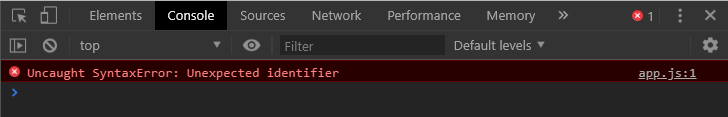
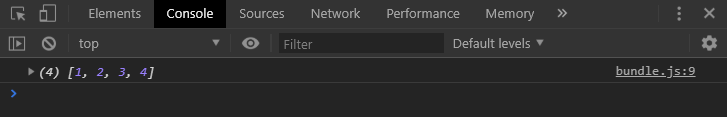

<p class="intro">A Module is simply a javascript file with a bunch of variables or functions which can be imported and used in other javascript files. With ES6, working with modules has become fun. Let me tell you how.</p>

Before ES6 Modules, we used to have `script` tags in our `html` file to import and use a library. Let's see the example below:

```html
<!-- index.html -->
<html>
  <head>
    <title>Before ES6 Modules</title>
  <head>
  <body>
  <script src="https://cdnjs.cloudflare.com/ajax/libs/lodash.js/4.17.11/lodash.min.js"></script>
  <script src="./app.js"></script>
  </body>
</html>
```

```js
// app.js

const numbers = [1, 2, 2, 3, 4, 3];

const uniqNumbers = _.uniq(numbers); // _.uniq is coming from lodash

console.log(uniqNumbers); // [1, 2, 3, 4]
```

Above, we are including `lodash` in the `index.html` file. And we are using `uniq` function provided by `lodash` to find the unique numbers. Here, the `_` was not defined explicitly and someone looking at only the `app.js` file would have no idea from where the `_` is coming from. So, is there a better way to do it? Well, yeah!

### NPM - Node Package Manager

NPM is where all the javascript libraries are hosted. If you ever want to use one, you would have to install it from here. You must have <a href="https://nodejs.org/en/" target="_blank">NodeJS</a> installed in your system to use it. NPM comes with NodeJS.

Let's create a directory called `es6Modules` and `cd` into it. Create an `index.html` and an `app.js` file inside the directory.
Now, run the command `npm init` in your terminal inside this directory. It will ask a few questions about your project. After answering all the project related questions. It will generate a `package.json` file which contains the details about your project and also the libraries that you have installed from npm.

The directory structure would look something like below:

```
├── app.js
├── index.html
└── package.json
```

To install a package from NPM, you just have to type the command `npm install <package-name>` in your terminal.
For installing `lodash`, it would be `npm install lodash`. After running this command, you will see a folder called `node_modules` appear in your directory. It will contain all the libraries or packages that you have installed. Also, in your `package.json` file, `lodash` will be added to the dependencies section.

Now, that `lodash` is installed. Let's use it.

```js
// app.js
import _ from 'lodash'; // this is how you import an es6 module

const numbers = [1, 2, 2, 3, 4, 3];

const uniqNumbers = _.uniq(numbers);

console.log(uniqNumbers);
```

Now, let's reference `app.js` file in the `index.html` to run it.

```html
<!-- index.html -->
<html>
  <head>
    <title>ES6 Modules</title>
  <head>
  <body>
  <script src="./app.js"></script>
  </body>
</html>
```

Now, open the `index.html` file in the browser and check your console. Instead of seeing the unique Numbers, you are seeing an error something like below:

<figure>
  
  <figcaption>ES6 Modules are not supported in browsers</figcaption>
</figure>

Well, it turns out that browsers don't support ES6 Modules just yet. But that doesn't mean we can't use it. We can use package bundlers like webpack or parcel to compile our ES6 Modules syntax to something that our browsers understand.

For this tutorial, I am going to use webpack. To install webpack execute the command given below:

`npm install webpack webpack-cli --save-dev`

Now, create a `webpack.config.js` file in your root directory to configure webpack.

```js
// webpack.config.js

const path = require('path');

module.exports = {
  entry: './app.js', // entry point of our project
  output: {
    filename: 'bundle.js', // The name of the output file
    path: path.resolve(__dirname, 'dist') // The folder where output file will be generated
  }
};
```

Now, we need to add a script to our `package.json` file to run webpack and bundle our code. Open up `package.json` file and a script as given below:

```json
// package.json

"scripts": {
  "build": "webpack --config webpack.config.js"
}
```

Here, `--config` is used to specify our configuration file `webpack.config.js`.

Now, run the build script by running `npm run build` in your terminal. After running this script, you will see that webpack has generated a file called `bundle.js` inside `dist` folder.
This file contains the code that we have written in  `app.js` but in way that our browsers will understand. So, we now have to reference this file in `index.html`

```html
<!-- index.html -->
<html>
  <head>
    <title>ES6 Modules</title>
  <head>
  <body>
    <script src="./dist/bundle.js"></script>
  </body>
</html>
```

If you open the `index.html` file in your browser, you will see the unique Numbers as below:

<figure>
  
  <figcaption>Bundled code by webpack works fine in the browser</figcaption>
</figure>


This is all for this post. In the next post, I will talk about writing and using our own ES6 Modules. Until then read the documentation of <a href="https://webpack.js.org/guides/" target="_blank">webpack</a> to learn more about all the awesome things it does.
