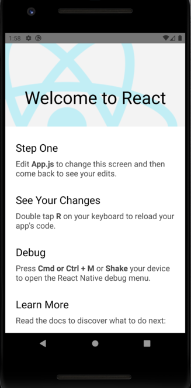
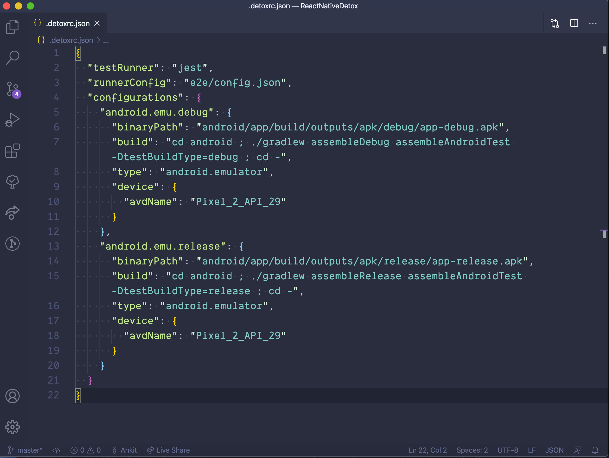
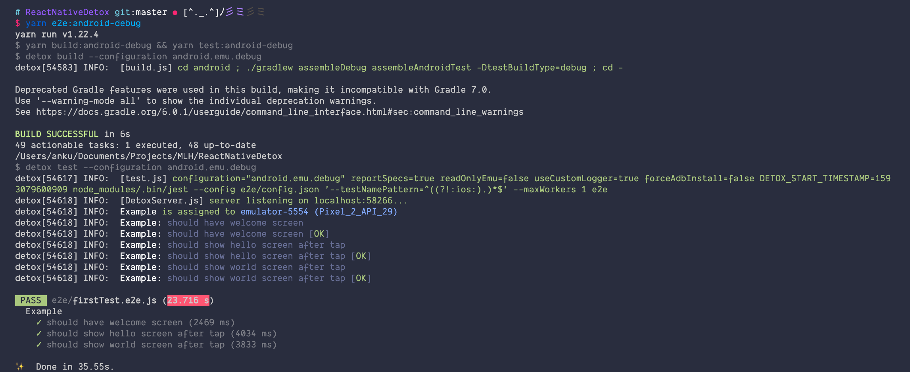

<p class="intro"><a href="https://github.com/wix/Detox" target="_blank">Detox</a> is an end to end testing library for your react native app that enables you to emulate user behavior and test how your app reacts to it, automatically.</p>

In this blog post, I will be going over setting up Detox from scratch in a React Native project for Android. In the future, I am planning to write another post where I will go through the `iOS` setup. 


### Setting up the Project 

The first step is to set up our React Native project. I am assuming you already have your development environment setup for react native and android. If not, then you can go through the <a href="https://reactnative.dev/docs/environment-setup" target="_blank">official documentation</a> to set up your environment. 

We will be using `react-native` cli for this. The following steps should bootstrap a react-native app.

```
$ npx react-native init ReactNativeDetox
$ cd ReactNativeDetox
```

First, you should have your android emulator running, and then you can run the following to start the `ReactNativeDetox` app in your emulator. 

```
$ yarn android
$ yarn start
```

`yarn android` will take a while to complete and it should ask you to run the metro bundler but in case it doesn't you can do that manually by running `yarn start`. After running those command the app should look like the following screenshot.


<figure>
  
  <figcaption>Startup screen of ReactNativeDetox App</figcaption>
</figure>


### Adding Detox

Detox needs to be set up with a test runner like `Jest` or `Mocha`. It supports both but I am going to be using `Jest` for this tutorial since its recommended by Detox themselves.

First, we need to install detox locally from npm.

```
$ yarn add detox
```

Now we need to setup Detox with Jest. Thankfully, we don't have to do this on our own. The Detox cli can do this for us. 

```
$ npx detox init -r jest

detox[43072] INFO:  [init.js] Created a file at path: e2e/config.json
detox[43072] INFO:  [init.js] Created a file at path: e2e/environment.js
detox[43072] INFO:  [init.js] Created a file at path: e2e/firstTest.e2e.js
detox[43072] INFO:  [init.js] Created a file at path: e2e/config.json
```

After running the above command, Detox will create four files for us. For the scope of this tutorial, we don't need to be concerned with `e2e/config.json` and `e2e/environment.js`. But if you are interested you can read about them  <a href="https://github.com/wix/Detox/blob/master/docs/Guide.Jest.md#e2econfigjson" target="_blank">here</a>.


You will also need to install `jest` and `jest-circus` as dev dependencies.


```
$ yarn add jest jest-circus
```

### Editing `.detoxrc.json`

First, you need to find out the name of the emulator you are running. You can do that by running the following - 

```
$ emulator -list-avds

Pixel_2_API_29
```

As you can see, my emulator name is `Pixel_2_API_29`.

Now, you will need to replace the `configuration` object in `.detoxrc.json` file with the following - 

```js
  "configurations": {
    "android.emu.debug": {
      "binaryPath": "android/app/build/outputs/apk/debug/app-debug.apk",
      "build": "cd android ; ./gradlew assembleDebug assembleAndroidTest -DtestBuildType=debug ; cd -",
      "type": "android.emulator",
      "device": {
        "avdName": "YOUR_EMULATOR_NAME"
      }
    },
    "android.emu.release": {
      "binaryPath": "android/app/build/outputs/apk/release/app-release.apk",
      "build": "cd android ; ./gradlew assembleRelease assembleAndroidTest -DtestBuildType=release ; cd -",
      "type": "android.emulator",
      "device": {
        "avdName": "YOUR_EMULATOR_NAME"
      }
    }
  }
  ```

For me, it would look like the following -


<figure>
  
  <figcaption>.detoxrc.json file</figcaption>
</figure>

We have added the detox configurations for the `debug` and `release` builds of our app. We told Detox about the `binaryPath` of our app and also the emulator which Detox will use to run the tests.


### Adding Detox dependency to the Android project


1. Open your root buildscript (i.e. `android/build.gradle`) and register both `google()` and `detox` as repository lookup points in all projects:


```java
allprojects {
    repositories {
        mavenLocal()
        maven {
            // All of React Native (JS, Obj-C sources, Android binaries) is installed from npm
            url("$rootDir/../node_modules/react-native/android")
        }
        maven {
            // Android JSC is installed from npm
            url("$rootDir/../node_modules/jsc-android/dist")
        }

        /* 👇 */
        maven {
            // All of Detox' artifacts are provided via the npm module
            url "$rootDir/../node_modules/detox/Detox-android"
        }

        google()

        /* 👆 */
        jcenter()
        maven { url 'https://www.jitpack.io' }
    }
}
```


We also need to update our `minSdkVersion` to `18` as required by detox and add `Kotlin`. As of now, the latest version of Kotlin is `1.3.70` so, I will use that.


In `android/build.gradle` file, add the following code - 

```java
buildscript {
    ext {
        buildToolsVersion = "28.0.3"
        ext.kotlinVersion = "1.3.70" /* 👈 */
        minSdkVersion = 18  /* 👈 */
        compileSdkVersion = 28
        targetSdkVersion = 28
    }
    repositories {
        google()
        jcenter()
    }
    
    dependencies {
        classpath("com.android.tools.build:gradle:3.5.2")
        classpath "org.jetbrains.kotlin:kotlin-gradle-plugin:$kotlinVersion" /* 👈 */

        // NOTE: Do not place your application dependencies here; they belong
        // in the individual module build.gradle files
    }
}
```


2. We need to add the following dependencies in our app's buildscript. Open up `android/app/build.gradle` file and update the `dependencies` section as follows - 


```java
dependencies {
   //...
   //...

    if (enableHermes) {
        def hermesPath = "../../node_modules/hermes-engine/android/";
        debugImplementation files(hermesPath + "hermes-debug.aar")
        releaseImplementation files(hermesPath + "hermes-release.aar")
    } else {
        implementation jscFlavor
    }
    androidTestImplementation('com.wix:detox:+') /* 👈 */
}
```

We also need to add the following to the `defaultConfig` subsection in the same file -

```java
    defaultConfig {
        applicationId "com.demorntester"
        minSdkVersion rootProject.ext.minSdkVersion
        targetSdkVersion rootProject.ext.targetSdkVersion
        versionCode 1
        versionName "1.0"
        testBuildType System.getProperty('testBuildType', 'debug')  /* 👈 */ 
        testInstrumentationRunner 'androidx.test.runner.AndroidJUnitRunner' /* 👈 */
    }
```


3. We need to create an Android Test class. Add the file `android/app/src/androidTest/java/com/reactnativedetox/DetoxTest.java` with the following code - 


```java

package com.reactnativedetox;

import com.wix.detox.Detox;

import org.junit.Rule;
import org.junit.Test;
import org.junit.runner.RunWith;

import androidx.test.ext.junit.runners.AndroidJUnit4;
import androidx.test.filters.LargeTest;
import androidx.test.rule.ActivityTestRule;

@RunWith(AndroidJUnit4.class)
@LargeTest
public class DetoxTest {

    @Rule
    // Replace 'MainActivity' with the value of android:name entry in 
    // <activity> in AndroidManifest.xml
    public ActivityTestRule<MainActivity> mActivityRule = new ActivityTestRule<>(MainActivity.class, false, false);

    @Test
    public void runDetoxTests() {
        Detox.DetoxIdlePolicyConfig idlePolicyConfig = new Detox.DetoxIdlePolicyConfig();
        idlePolicyConfig.masterTimeoutSec = 60;
        idlePolicyConfig.idleResourceTimeoutSec = 30;

        Detox.runTests(mActivityRule, idlePolicyConfig);
    }
}
```


That's all the setup we need to do. We are now ready to write the tests!! 🚀


### Writing our first test

Detox has already written some tests for us in the `e2e/firstTest.spec.js` file. But the tests will fail as our app starting screen is different and it won't be able to find elements by `testID`. Instead of updating our tests, for this tutorial we will update the contents of our `App.js` file according to the tests Detox has written. Copy over the contents from  <a href="https://github.com/anku255/react-native-detox-setup/blob/master/App.js" target="_blank">here</a> to your `App.js`.


Now, we are ready to run the tests. There is just one little thing we need to do. We need to add scripts in our `package.json` file to run the detox tests.

Open up `package.json` file and add the following to the `scripts` section - 


```json
"scripts": {
  "android": "react-native run-android",
  "ios": "react-native run-ios",
  "start": "react-native start",
  "test": "jest",
  "lint": "eslint .",
  "build:android-debug": "detox build --configuration android.emu.debug", /* 👈 */
  "test:android-debug": "detox test --configuration android.emu.debug", /* 👈 */
  "e2e:android-debug": "yarn build:android-debug && yarn test:android-debug" /* 👈 */
},
```


Now, we need to start our react-native packager  - 

```
$ yarn start
```

And then in a new terminal run the following script to start running the tests - 

```
$ yarn e2e:android-debug
```

We are running the detox tests in debug mode. This is will take a while when running for the first time. After completing the tests should start running in your simulator and the output will be displayed in your terminal as following - 


<figure>
  
  <figcaption>Output after running the tests.</figcaption>
</figure>


That's it! Now, you can start writing tests and exlpore detox. You can learn more about detox from their documentation  <a href="https://github.com/wix/Detox/tree/master/docs" target="_blank">here</a>. The source code of this tutorial is available on  <a href="https://github.com/anku255/react-native-detox-setup/" target="_blank">Github.</a>

